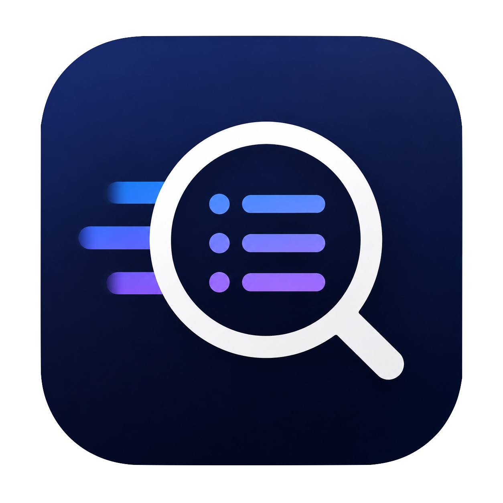
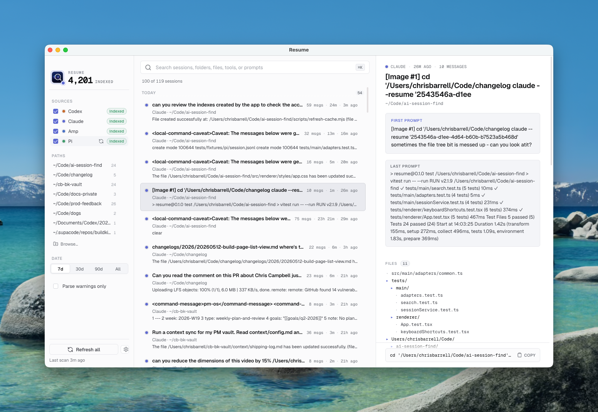

<p align="center">
  
</p>

<h1 align="center">Resume</h1>

<p align="center">
  Local-first macOS utility that indexes past sessions from multiple AI coding assistants (Codex, Claude Code, Amp, Pi) and lets you search them and copy a shell command to resume one. Designed to be opened with a goal and closed within seconds — Spotlight/Raycast-style.
</p>

<p align="center">
  
</p>

## Status

Personal project. Published in case it's useful as a reference. **Not soliciting contributions, issues, or feature requests** — please fork if you want to take it somewhere.

Not affiliated with OpenAI (Codex), Anthropic (Claude), Sourcegraph (Amp), or any other vendor whose session formats are read.

## Develop

Requires Node 20+ and pnpm.

```
pnpm install
pnpm dev      # Vite + Electron in dev mode
pnpm test     # Vitest
pnpm build    # production build
pnpm package  # build a signed-less .dmg/.zip into release/
```

See `CLAUDE.md` for architecture notes and `.impeccable.md` for design constraints.

## License

MIT — see `LICENSE`.
